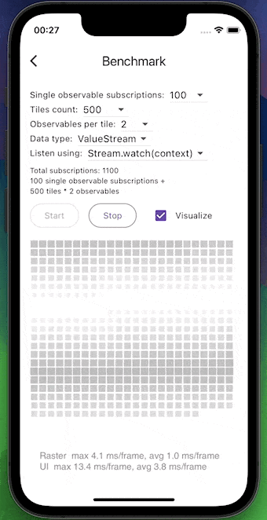

# context_watch


[](https://pub.dev/packages/context_watch)
[](https://pub.dev/packages/context_watch)
[](https://pub.dev/packages/context_watch)
[](https://pub.dev/packages/context_watch)

Listen to `Listenable` (`ValueNotifier`/`AnimationController`/`ScrollController`/`TabController` etc.) or `Stream`/`ValueStream` changes using a simple `observable.watch(context)`. No strings attached.

**Note:** Flutter 3.17.0-1.0.pre.38 or higher is required.

## Getting started

```shell
flutter pub add context_watch
```

Wrap your app in a `ContextWatchRoot`
```dart
ContextWatchRoot(
  child: MaterialApp(...),
);
```

## Usage

```dart
final counterNotifier = ValueNotifier(0);

class Example extends StatelessWidget {
  @override
  Widget build(BuildContext context) {
    final counter = counterNotifier.watch(context);
    return Text('Counter: $counter');
  }
}
```

That's it! No builders, no custom base classes.

Just call `watch()` on your observable value and you've got a reactive widget. `watch()`'ing a `ValueListenable`,
`ValueStream` or `SynchronousFuture` will also give you the current value synchronously, right away.

It doesn't matter where you call `watch()` from or how many times you call it. While in a build phase, it will
always register the `context` as a listener to the observable value. Whenever the observable notifies of a change,
the `context` will be marked as needing a rebuild.

### Supported observable types

- `Listenable` (`ValueNotifier`/`AnimationController`/`ScrollController`/`TabController` etc.)
- `Stream`/`ValueStream`
- `Future`/`SynchronousFuture`

## Additional information

### `context.unwatch()`

If you have conditional `watch()`'es in your `build` method, you might want to add an unconditional `context.unwatch()`
call to avoid potential unnecessary rebuilds. This doesn't incur any performance penalty and can be called multiple
times, so feel free to call it whenever you need.

#### Why is it needed?

Unfortunately, `InheritedWidget`s in Flutter never unsubscribe their dependents. `context_watch` does everything it can
to compensate for that, so that if widget goes from 2 `watch()`'es to only 1 - the second `watch()` will be
discarded, as expected. But still, there exists a case where it's not possible to automagically compensate for the
Flutter's limitation. If a widget goes from 1 (or more) `watch()` to 0, the `context` will still be registered as a
listener to all of them, as it's impossible to know that `watch()`'es are now completely gone from the `build` method.

So, given this example:
```dart
Widget build(BuildContext context) {
  if (condition1) {
    counter1.watch(context);
  }
  if (condition2) {
    counter2.watch(context);
  }
  ...
}
```
if widget transitions from `condition1 == true && condition2 == true` to `condition1 == false && condition2 == true` - it
will be rebuilt only when `counter2` changes. But if widget transitions from `condition1 == true && condition2 == true` to
`condition1 == false && condition2 == false` - it will be rebuilt when either `counter1` or `counter2` changes.

To avoid this, you can unconditionally call `context.unwatch()` inside the `build` method:
```dart
Widget build(BuildContext context) {
  context.unwatch();
  if (condition1) {
    counter1.watch(context);
  }
  if (condition2) {
    counter2.watch(context);
  }
  ...
}
```
This will ensure that all conditional `watch()`'es are discarded each `build`. Calling `context.unwatch()` doesn't
incur any performance penalty, so feel free to call it unconditionally in all your `build` methods whenever you need.

### Performance

Sounds too good to be true? It's not! But it comes at a slight performance cost.

Here's some benchmark results I got on my test device (Xiaomi Mi 9T Pro, Android 11):
```
Summary                                                         Ratio      Total subscriptions     Subscriptions description           Frame times                               
Stream.watch(context) vs StreamBuilder                          1.05x      2 total subs            1 tiles * 2 observables             125.75μs/frame vs 119.59μs/frame          
ValueListenable.watch(context) vs ValueListenableBuilder        0.99x      2 total subs            1 tiles * 2 observables             121.17μs/frame vs 121.83μs/frame          
Stream.watch(context) vs StreamBuilder                          0.99x      20 total subs           10 tiles * 2 observables            122.13μs/frame vs 122.84μs/frame          
ValueListenable.watch(context) vs ValueListenableBuilder        1.02x      20 total subs           10 tiles * 2 observables            125.49μs/frame vs 122.70μs/frame          
Stream.watch(context) vs StreamBuilder                          1.02x      200 total subs          100 tiles * 2 observables           132.69μs/frame vs 130.19μs/frame          
ValueListenable.watch(context) vs ValueListenableBuilder        1.04x      200 total subs          100 tiles * 2 observables           134.43μs/frame vs 129.11μs/frame          
Stream.watch(context) vs StreamBuilder                          1.05x      400 total subs          200 tiles * 2 observables           150.99μs/frame vs 143.31μs/frame          
ValueListenable.watch(context) vs ValueListenableBuilder        1.02x      400 total subs          200 tiles * 2 observables           136.61μs/frame vs 133.89μs/frame          
Stream.watch(context) vs StreamBuilder                          1.04x      1000 total subs         500 tiles * 2 observables           178.28μs/frame vs 170.82μs/frame          
ValueListenable.watch(context) vs ValueListenableBuilder        1.10x      1000 total subs         500 tiles * 2 observables           180.63μs/frame vs 163.78μs/frame          
Stream.watch(context) vs StreamBuilder                          1.06x      1500 total subs         750 tiles * 2 observables           221.11μs/frame vs 207.65μs/frame          
ValueListenable.watch(context) vs ValueListenableBuilder        1.18x      1500 total subs         750 tiles * 2 observables           198.62μs/frame vs 168.99μs/frame          
Stream.watch(context) vs StreamBuilder                          1.20x      2000 total subs         1000 tiles * 2 observables          282.68μs/frame vs 235.82μs/frame          
ValueListenable.watch(context) vs ValueListenableBuilder        1.22x      2000 total subs         1000 tiles * 2 observables          236.68μs/frame vs 194.15μs/frame          
Stream.watch(context) vs StreamBuilder                          1.17x      10000 total subs        5000 tiles * 2 observables          56236.86μs/frame vs 48076.33μs/frame      
ValueListenable.watch(context) vs ValueListenableBuilder        1.65x      10000 total subs        5000 tiles * 2 observables          34541.57μs/frame vs 20967.51μs/frame      
Stream.watch(context) vs StreamBuilder                          1.31x      20000 total subs        10000 tiles * 2 observables         193292.91μs/frame vs 147844.86μs/frame    
ValueListenable.watch(context) vs ValueListenableBuilder        1.06x      20000 total subs        10000 tiles * 2 observables         100301.20μs/frame vs 94399.64μs/frame     
Stream.watch(context) vs StreamBuilder                          1.36x      40000 total subs        20000 tiles * 2 observables         406689.40μs/frame vs 298047.43μs/frame    
ValueListenable.watch(context) vs ValueListenableBuilder        1.37x      40000 total subs        20000 tiles * 2 observables         250308.56μs/frame vs 182833.27μs/frame    
Stream.watch(context) vs StreamBuilder                          0.98x      1 total subs            1 single stream subscriptions       122.08μs/frame vs 123.96μs/frame          
ValueListenable.watch(context) vs ValueListenableBuilder        1.03x      1 total subs            1 single stream subscriptions       126.48μs/frame vs 122.88μs/frame          
Stream.watch(context) vs StreamBuilder                          1.00x      10 total subs           10 single stream subscriptions      125.51μs/frame vs 125.95μs/frame          
ValueListenable.watch(context) vs ValueListenableBuilder        1.02x      10 total subs           10 single stream subscriptions      125.07μs/frame vs 122.17μs/frame          
Stream.watch(context) vs StreamBuilder                          1.04x      100 total subs          100 single stream subscriptions     132.01μs/frame vs 127.47μs/frame          
ValueListenable.watch(context) vs ValueListenableBuilder        1.03x      100 total subs          100 single stream subscriptions     128.34μs/frame vs 124.88μs/frame          
Stream.watch(context) vs StreamBuilder                          1.06x      200 total subs          200 single stream subscriptions     137.71μs/frame vs 130.06μs/frame          
ValueListenable.watch(context) vs ValueListenableBuilder        1.14x      200 total subs          200 single stream subscriptions     143.15μs/frame vs 125.15μs/frame          
Stream.watch(context) vs StreamBuilder                          1.22x      500 total subs          500 single stream subscriptions     171.45μs/frame vs 140.18μs/frame          
ValueListenable.watch(context) vs ValueListenableBuilder        1.16x      500 total subs          500 single stream subscriptions     151.27μs/frame vs 130.28μs/frame          
Stream.watch(context) vs StreamBuilder                          1.41x      750 total subs          750 single stream subscriptions     214.34μs/frame vs 151.94μs/frame          
ValueListenable.watch(context) vs ValueListenableBuilder        1.30x      750 total subs          750 single stream subscriptions     171.82μs/frame vs 132.63μs/frame          
Stream.watch(context) vs StreamBuilder                          1.86x      1000 total subs         1000 single stream subscriptions    315.06μs/frame vs 169.10μs/frame          
ValueListenable.watch(context) vs ValueListenableBuilder        1.46x      1000 total subs         1000 single stream subscriptions    196.99μs/frame vs 135.27μs/frame
```

`example` contains both a [live benchmark](example/lib/benchmark_screen.dart) and an [automated one](example/test/stream_watch_benchmark.dart), so feel free to run them and compare the results on your device.
Don't forget to run them in `--profile` mode.


